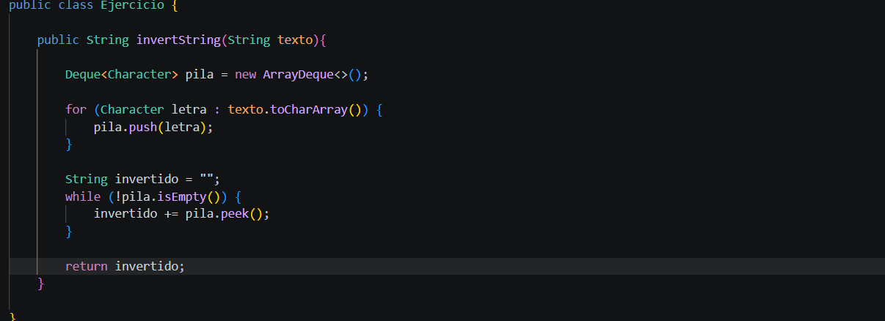

# Practica: Estructuras Dinamicas Lineales

## Datos del estudiante

- Nombre: Ariel Ushca
- Curso: Estructura de Datos

## Implementacion de estructuras dinamicas lineales

- Fecha: 6/8/2026

En esta sección se implementaran las siguientes estructuras dinamicas lineales:

- Listas enlazadas con LinkdList
- Pilas con Stank y Queue
- Colas con Queue

# Ejercicio uno

